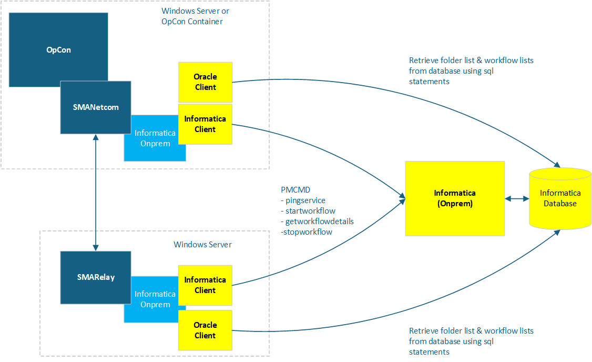

# Informatica On-Prem ACS Documentation

Latest version is 25.0.0

Informatica On-prem ACS provides access to the Informatica On-prem environment workflows. It uses the Informatica Client components
to communicate with the Informatica environment. It is part of the ACS (Agentless Connector System) suite of products. 

ACS is a new OpCon Agent type that provides a framework for agent development. It is an internal component provided by the SMANetCom module. All integrations are generated DLL's and placed in a standard folder that is monitored by the ACS services.

These modules are loaded into the OpCon environment during startup. New modules can be copied to the monitored folder and will be available for configuration after the SMA OpCOn Service Manager and SMA OpCon RestAPI services are restarted.

All code and task / agent screen definitions are contained in the generated DLL that is placed in the monitored folder. To display the task and agent definitions, the form layouts are retrieved from the DLL and passed to Solution Manager to render the screen layout. Agent / task definitions are stored as JSON values in the OpCon database tables.

Agent / task definitions for the ACS environment can only be created / updated using Solution Manager.
JORS support for the ACS environment is only provided through Solution Manager.

## Implementation

The Informatica ACS On-prem connection is an ACS implementation that can be installed alongside either within an OpCon system or a SmaRelay installation. The Informatica ACS On-prem uses the Informatica client library to communicate with the Informatica environment. It uses the Informatica Pmcmd and Pmrep command line utilities to submit commands to the Informatica environment.

The connector uses SQL statements to retrieve a list of folders and workflows associated with a folder from the Informatica database.
The Informatica agent periodically retrieves the list of folders from the Informatica database and stores this in a **folders.txt** file. 

The Pmcmd utility is used to submit workflow requests and check for Informatica availability.

The Pmcmd Informatica **pingservice** command is used to determine if the Informatica environment is available for accepting workflow submission requests. If the command returns a successful completion, then the connection is marked as available in OpCon and it will be possible to submit workflow submissions.

The integration provides a single job-type **Run** that can be used to define workflows to execute within the Informatica environment. The started workflows are monitored for completion.

During the task definition phase, the list of folders is retrieved from the **folders.txt** file and displayed in the folders drop-down list. When a folder is selected from the drop-down list, a list of workflows associated with the folder is retrieved using SQL statements and displayed in the workflow drop-down list.

The Pmcmd Informatica client is used to start and monitor workflows. The **startworkflow**  command starts a workflow and the **getworkflowdetails** command monitors the status of the started workflow. While a workflow is running, it is possible to submit a **stopworkflow** command to stop the workflow in the Informatica system (this is done by using the OpCon Kill function).

JobType              | Description
---------------------|------------
Run                  | Execute and monitor an Informatica workflow. 
